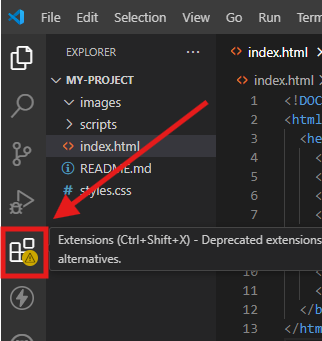

# Setting Up Your Project

## Importance of Project Organisation

**A well-organised project:**

- Makes collaboration easier.
- Simplifies debugging and maintenance.
- Enhances readability for others (and your future self).
- Encourages best practices and a professional approach from the start.

**Example:**
Imagine trying to find a misplaced file in a folder filled with hundreds of unlabelled items. Organisation saves time and prevents confusion!

## Best Practices for Naming Projects and Files

Effective naming conventions are a key part of maintaining organisation.

### Why Naming Matters

- Descriptive names make it easier to understand the purpose of a file or folder at a glance.
- Consistent naming ensures predictability and reduces errors when referencing files in your code.

### General Guidelines

1. **Be Descriptive and Specific:**
   - Use names that reflect the file or folder’s purpose.
   - Example:
     - **Good:** `contact-form.html`
     - **Bad:** `form1.html`
2. **Stick to Lowercase Letters:**
   - Avoid uppercase to prevent issues in case-sensitive systems.
   - Use hyphens (`-`) to separate words instead of spaces.
   - Example: `project-overview.md` instead of `Project Overview.md`.
3. **Follow a Logical Structure:**
   - Group related files together (e.g., all images in an `images/` folder).
4. **Avoid Special Characters:**
   - Stick to letters, numbers, hyphens, and underscores.

### Naming Your Project

- Use a name that reflects the project's purpose or theme.
- Example:
  - A portfolio project might be named portfolio-site.
  - A weather app could be named weather-tracker.

## File and Folder Structure for Web Projects

**Recommended Basic Structure:**

```scss
my-project/
├── index.html       (Main HTML file)
├── styles.css       (CSS file for styling)
├── images/          (Folder for images)
├── scripts/         (Folder for JavaScript files - if applicable)
└── README.md        (File to document the project)
```

**Key Points:**

- The `index.htm`l file serves as the entry point of your web project.
- The `styles.css` file contains all the visual styling rules.
- Keep all images in a dedicated `images`/ folder for easy reference.
- Use meaningful, descriptive names for files and folders (e.g., `user-profile.png` instead of `img1.png`)..

**Notice:**

In the upcoming modules, you will learn in detail about what HTML and CSS are and how they work. For now, focus on creating project folder and files (`index.html`, `styles.css`, and `README.md`) and copying the provided code snippets into these files. This will help you set up a project structure and explore tools like VS Code and Live Server. Later lessons in this module will also guide you extensively on creating a `README.md` file and using it for Git practices.

## Understanding the Role of Core Files

### index.html:

- The backbone of your project where content and structure are defined.
- Example snippet:
  ```html
  <!DOCTYPE html>
  <html lang="en">
    <head>
      <meta charset="UTF-8" />
      <meta name="viewport" content="width=device-width, initial-scale=1.0" />
      <title>My First Project</title>
      <link rel="stylesheet" href="styles.css" />
    </head>
    <body>
      <h1>Welcome to My Project</h1>
      <p>This is a sample project setup.</p>
    </body>
  </html>
  ```

### styles.css:

- Handles the appearance of your HTML elements.
- Example snippet:

  ```css
  body {
    font-family: Arial, sans-serif;
    background-color: #f0f0f0;
    margin: 0;
    padding: 0;
  }

  h1 {
    color: #333;
    text-align: center;
  }
  ```

## Using a Text Editor (e.g., VS Code)

A text editor is a vital tool for writing and managing code in web development. Think of it as the workspace where you build your projects. Some text editors are basic (like Notepad), while others, like Visual Studio Code (VS Code), are feature-rich and tailored for developers.

### Why Use a Code-Focused Editor like VS Code?

- Built-in syntax highlighting (makes your code easier to read).
- Extensions for additional features like debugging, live previews, and formatting.
- Integrated terminal to run commands without leaving the editor.

### Step-by-Step Guide to Using VS Code

1. Installing VS Code
   - Download from the official website: [Visual Studio Code](https://code.visualstudio.com/).
   - Follow the installation instructions for your operating system (Windows, macOS, or Linux).
2. Opening Files and Folders in VS Code

   **Open a Folder (Recommended for Projects):**

   - Launch VS Code.
   - Go to `File > Open Folder`.
   - Select the folder where your project files (e.g., `index.html, styles.css`) are stored.

     **Opening Individual Files:**

   - Drag and drop the file (e.g., `index.html`) into VS Code.
   - Or, go to `File > Open File` and navigate to the file's location.

**Tip:** Always open the project folder instead of individual files to keep everything organised.

## Customising VS Code with Extensions

VS Code has a powerful extensions marketplace. Here's how to set up useful tools for beginners:

### Installing Extensions:

- Click on the Extensions icon in the left sidebar (it looks like four squares).
  
- Search for the desired extension and click Install. Go ahead and install the Live Server Extension.
  

### Recommended Extensions for Beginners:

**Live Server:**

- Provides a local development server with live reload functionality for your HTML/CSS files.
- Search for "Live Server" in Extensions and install it.
- **Prettier – Code Formatter:**
- Formats your code automatically for better readability.

**HTML CSS Support:**

- Helps with auto-completion for HTML and CSS.

## Viewing Your Project in the Browser (Live Server)

1. Open your index.html file in VS Code.
2. Right-click anywhere in the editor and select "Open with Live Server".
   
3. Your default web browser will open, displaying your index.html page.
4. Live Reload: Any changes you make in your code will automatically refresh the browser view.

### Navigating VS Code

**Explorer Panel:**

- Located on the left, shows all files in your project folder.
  

**Editor Area:**

- The central area where you write and edit your code.
  

**Status Bar:**

- At the bottom, displays information like the file type, line/column numbers, and Git branch.
  

## Using the Integrated Terminal

The terminal in VS Code allows you to run commands without leaving the editor.

1. Opening the Terminal:

   - Go to View > Terminal or press Ctrl + `` (backtick key) on your keyboard.
     

1. What the Terminal is For:

   - Running Git commands (e.g., `git init`, `git commit`).
   - Installing and managing packages/tools.
   - Running scripts in projects (e.g., starting a development server).

1. Basic Terminal Commands for Beginners:
   - `ls` (Mac/Linux) or `dir` (Windows): Lists files in the current directory.
   - `cd foldername`: Navigates into a folder.
   - `cd ..`: Moves up one directory level.
   - `clear`: Clears the terminal screen.

## Activities

1. Set Up Live Server:

   - Install the Live Server extension.
   - Create a basic `index.html` file and test it in the browser using Live Server.

2. Customise Your Workspace:

   - Install the Prettier extension and configure it for automatic formatting.
   - Change the theme of VS Code (go to `File > Preferences > Color Theme`).

3. Explore the Terminal:
   - Open the terminal and run basic commands like `ls` or `dir`.
   - Navigate to your project folder using the `cd` command.
